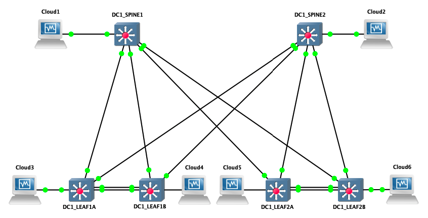

# Arista Validated Design with CloudVision deployment

## About

This example implement a basic __EVPN/VXLAN Fabric__ based on __[Arista Validated Design roles](https://github.com/aristanetworks/ansible-avd)__ with one layer of 2 spines and one layer of leafs (4 devices) using MLAG. Configuration deployment is not managed by eos EAPI, but through Arista CloudVision based on __[arista.cvp collection](https://github.com/aristanetworks/ansible-cvp/)__

It helps to demonstrate how to bring up an Arista EVPN/VXLAN Fabric from the first boot.



> Lab is based on GNS3 topology and a CloudVision server running on a VMware instance.

## Getting Started

```shell
# Install python requirements
$ pip install -r requirements.txt

# Edit ZTP file
# Powerup your devices

# Run Ansible playbook 
$ ansible-playbook dc1-fabric-deploy-cvp.yml
```

## Ressources

- Ansible [Arista Validated Design](https://github.com/aristanetworks/ansible-avd) repository.
- [Ansible CloudVision Collection](https://github.com/aristanetworks/ansible-cvp) repository.
- [How to install](INSTALL.md) demo environment.
- [Detailled demo script](DEMO.md).

## License

Project is published under [3-Clause BSD License](LICENSE).
